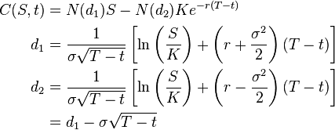

## What is an option?

Option

A financial derivative that represents a contract sold by one party (option writer) to another party (option holder). The contract offers the buyer the right, but not the obligation, to buy (call) or sell (put) a security or other financial asset at an agreed-upon price (the strike price) during a certain period of time or on a specific date (exercise date).

---

## What is Black-Scholes model?

The Black-Scholes  or Black-Scholes-Merton model is a mathematical model of a financial market containing certain derivative investment instruments. From the model, one can deduce the Black-Scholes formula, which gives a theoretical estimate of the price of European-style options. The formula led to a boom in options trading and legitimised scientifically the activities of the Chicago Board Options Exchange and other options markets around the world. lt is widely used, although often with adjustments and corrections, by options market participants.Many empirical tests have shown that the Black-Scholes price is "fairly close" to the observed prices, although there are well-known discrepancies such as the "option smile"

---

## What is the Black-Scholes formula for a European call?

---

## Why this app?

Having an online calculator can be helpfull for quick back off the envelope calculations.

---&radio

## Quiz

What is an option?

1. a choice
2. a derivative contract
3. a dog
4. i do not know

*** .hint
agreement

*** .explanation
A financial derivative that represents a contract.

